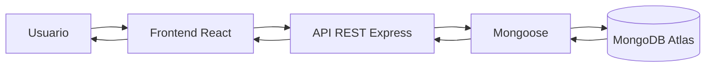

# KERA

Aplicación web de cosmética natural desarrollada con React, conectada a una API REST creada con Node.js, Express y MongoDB.

## Descripción

En esta cuarta fase del proyecto se conecta la interfaz frontend con la API REST desarrollada previamente.

La aplicación permite consultar, crear, editar y eliminar productos almacenados en MongoDB.

## Tecnologías usadas

### Frontend

- React
- Vite
- JavaScript
- CSS

### Backend

- Node.js
- Express
- MongoDB Atlas
- Mongoose
- CORS

### Despliegue

- Vercel
- GitHub

## Instalación y ejecución

### Backend

Desde la raíz del proyecto:

```bash
npm install
node index.js
```

### Frontend

Entrar en la carpeta `frontend`:

```bash
cd frontend
npm install
npm run dev
```

La aplicación se ejecutará en el servidor local indicado por Vite.

## Variables de entorno

El frontend utiliza la siguiente variable de entorno para establecer la conexión con la API:

```env
VITE_API_URL=
```

Esta variable debe configurarse en el archivo `.env` del frontend.

Se incluye el archivo `frontend/.env.example` como referencia para configurar el proyecto.

Las credenciales y otros datos sensibles no se incluyen en el repositorio.

## API REST

La aplicación frontend se comunica con la API REST desarrollada con Node.js y Express.

### Endpoints de productos

| Método | Endpoint | Descripción |
|---|---|---|
| GET | `/api/products` | Obtener todos los productos |
| GET | `/api/products/:id` | Obtener un producto por su ID |
| POST | `/api/products` | Crear un nuevo producto |
| PUT | `/api/products/:id` | Actualizar un producto |
| DELETE | `/api/products/:id` | Eliminar un producto |

La API está desplegada en Vercel:

https://kera-seven.vercel.app/

## Flujo de la aplicación



## Funcionalidades

La aplicación permite:

- Consultar los productos almacenados en MongoDB.
- Crear nuevos productos mediante un formulario.
- Editar productos existentes.
- Eliminar productos.
- Mostrar las imágenes de los productos mediante URL.
- Gestionar los estados de carga y error durante las peticiones a la API.
- Adaptar la interfaz a diferentes tamaños de pantalla.

## Aplicación desplegada

### Frontend

https://kera-frontent.vercel.app/

### Backend

https://kera-seven.vercel.app/